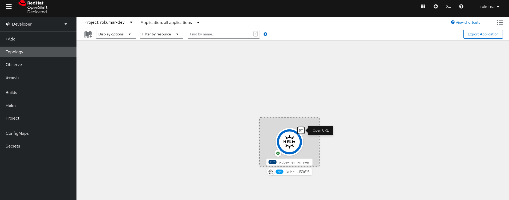
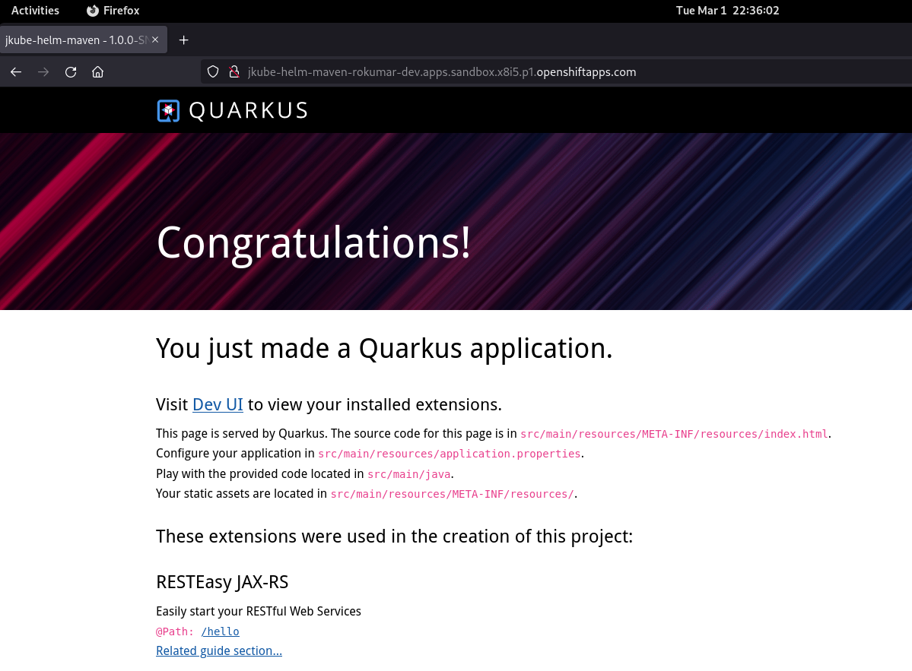

# Automatically Generate & Package Helm Charts for your Java application (Maven)

This is a demo repository used in one of Red Hat Developer Sandbox Article 

## Contents
- [Prerequisites](#prerequisites)
- [Preparing Application](#preparing-application)
- [How to Build?](#how-to-build)
- [How to Run Locally?](#how-to-run-locally)
- [Provision your free Red Hat OpenShift Development Cluster:](#provision-your-free-red-hat-openshift-development-cluster)
- [Building Image and Generating Helm Chart of your application](#building-image-and-generating-helm-chart-of-your-application)
- [Publishing Helm Chart to a Helm Registry](#publishing-helm-chart-to-a-helm-registry)
- [Deploying Published Helm Chart via Helm CLI](#deploying-published-helm-chart-via-helm-cli)
- [Cleanup](#cleanup)


## Prerequisites
You’d need the following things in order to do this activity:
- Red Hat OpenShift Developer Sandbox Account
- [oc - OpenShift Command Line Interface CLI (optional)](https://developers.redhat.com/blog/2021/04/21/access-your-developer-sandbox-for-red-hat-openshift-from-the-command-line#first_stop__the_openshift_dashboard)
- [Java Development Kit](https://adoptopenjdk.net/)
- A text editor
- Helm CLI

## Preparing Application
This project is generated from [code.quarkus.io](https://code.quarkus.io/). We basically select required dependencies for a typical REST microservice from web interface.

## How to Build?
```shell
$ ./mvnw clean install
```

## How to Run Locally?
```shell
$  java -jar target/quarkus-app/quarkus-run.jar
```
In another terminal, do a CURL to this URL:

```shell
$ curl localhost:8080/hello
Hello RESTEasy
```

## Provision your free Red Hat OpenShift Development Cluster
[Red Hat OpenShift Developer Sandbox](https://developers.redhat.com/developer-sandbox) is a free OpenShift cluster that gives you the experience of working with an actual Kubernetes Cluster and learning more about it. Unlike other cloud platforms, it doesn’t require any credit card (since it’s targeted towards Developers) . You just need to create a [Red Hat Account](https://sso.redhat.com/auth/realms/redhat-external/login-actions/registration?client_id=rhd-web&tab_id=lsjXrypZMMk) and use that to provision your OpenShift Cluster.

Once you’ve created an account and logged into your OpenShift cluster.

You can also connect to this OpenShift Cluster from your terminal. This would require oc CLI binary to be installed on your machine. You can read more about this in this blog post here:

[Access your Developer Sandbox for Red Hat OpenShift from the command line](https://developers.redhat.com/blog/2021/04/21/access-your-developer-sandbox-for-red-hat-openshift-from-the-command-line#)

To authenticate your laptop to the cluster, `oc login` is used but it is not mandatory. We can also specify OpenShift Developer Sandbox Cluster configuration via properties.

After clicking on the copy login command option, use Devsandbox user and click Display Token. Copy command and paste it in your terminal:

```shell
$ oc login --token=sha256~%TOKEN% --server=https://%SERVER%:6443
Logged into "https://%SERVER%:6443" as "%USERNAME%" using the token provided.

You have access to the following projects and can switch between them with 'oc project <projectname>':

  * %USERNAME%-dev
    %USERNAME%-stage

Using project "%USERNAME-dev".
Welcome! See 'oc help' to get started.
```

## Building Image and Generating Helm Chart of your application:
We’d be using [Eclipse JKube](https://github.com/eclipse/jkube) to package and deploy this application to Red Hat OpenShift. Since we’re using the maven project we’ll use the [OpenShift Maven Plugin](https://www.eclipse.org/jkube/docs/openshift-maven-plugin). If you’re a Gradle user, you can also use the [OpenShift Gradle Plugin](https://www.eclipse.org/jkube/docs/openshift-gradle-plugin). You can find more information about Eclipse JKube in the following articles:

- [Java development on top of Kubernetes using Eclipse JKube](https://developers.redhat.com/blog/2020/08/24/java-development-on-top-of-kubernetes-using-eclipse-jkube)
- [Introduction to Eclipse JKube: Java tooling for Kubernetes and Red Hat OpenShift](https://developers.redhat.com/blog/2020/01/28/introduction-to-eclipse-jkube-java-tooling-for-kubernetes-and-red-hat-openshift?source=sso)
- [Get started with Eclipse JKube Kubernetes/OpenShift Gradle Plugins ](https://developers.redhat.com/articles/2021/12/09/get-started-gradle-plugins-eclipse-jkube)

OpenShift Maven Plugin is already added in this project. You can go ahead and use Eclipse JKube OpenShift Maven Plugin goals to build a container image, generate YAML manifests, and package them into a Helm Chart.

```shell
$ ./mvnw oc:build oc:resource oc:helm
```

These OpenShift Maven Plugin goals will do the following things:
- [oc:build](https://www.eclipse.org/jkube/docs/openshift-maven-plugin#jkube:build) : Creates a container image for your Java Maven application using Source to Image (S2I) build strategy. Image is built in a pod and pushed to OpenShift’s internal container registry.
- [oc:resource](https://www.eclipse.org/jkube/docs/openshift-maven-plugin#jkube:resource) : Generates opinionated YAML manifests (e.g. DeploymentConfig, Service, Route etc) for your Java Maven application. You can view them in the `target/classes/META-INF/jkube/openshift` directory.
- [oc:helm](https://www.eclipse.org/jkube/docs/openshift-maven-plugin#jkube:helm) : Package generated resources into Helm Chart 

## Publishing Helm Chart to a Helm Registry

Once you've generated Helm Chart, you can push it to some Helm regitry using [oc:helm-push](https://www.eclipse.org/jkube/docs/openshift-maven-plugin#jkube:helm-push) goal.

You can provide Helm registry configuration like this:
```xml
  <plugin>
    <groupId>org.eclipse.jkube</groupId>
    <artifactId>openshift-maven-plugin</artifactId>
    <version>${jkube.version}</version>
    <configuration>
      <helm>
        <snapshotRepository>
          <name>ChartMuseum</name>
          <url>http://localhost:8080/api/charts</url>
          <type>CHARTMUSEUM</type>
          <username>user1</username>
        </snapshotRepository>
      </helm>
    </configuration>
  </plugin>
```
You can run oc:helm-push task after that:
```shell
$ ./mvnw oc:helm-push
```

## Deploying Published Helm Chart via Helm CLI
Once you’ve pushed Helm Chart to a helm registry, you can deploy your application by pulling it and installing the chart via Helm CLI.

List all Helm registries:
```sh
$ helm repo list
```
Get the latest chart updates from registries:
```sh
$ helm repo update 
```
Search the chart we pushed in the previous step in helm registry (Note that `--devel` option is because our chart has `-SNAPSHOT` version)
```sh
$ helm search repo chartmusuem --devel
NAME                        	CHART VERSION 	APP VERSION	DESCRIPTION
chartmusuem/jkube-helm-maven	1.0.0-SNAPSHOT
```
Install chart
```sh
$ helm install --generate-name chartmusuem/jkube-helm-maven --devel
I0301 22:23:38.971633   37999 request.go:665] Waited for 1.198529433s due to client-side throttling, not priority and fairness, request: GET:https://api.sandbox.openshiftapps.com:6443/apis/security.openshift.io/v1?timeout=32s
NAME: jkube-helm-maven-1646153615
LAST DEPLOYED: Tue Mar  1 22:23:40 2022
NAMESPACE: rokumar-dev
STATUS: deployed
REVISION: 1
TEST SUITE: None
```

This would deploy all OpenShift resources contained in this Helm chart to the OpenShift cluster. Go to Red Hat OpenShift Developer Sandbox Console. You should see the application deployed in the Topology section:



Click on `Open URL` and you should be redirected to your application’s page:



## Cleanup
Once you’ve done testing it. You can undeploy your application using Helm uninstall command:
```shell
$ helm list
NAME                       	NAMESPACE  	REVISION	UPDATED                                	STATUS  	CHART                          	APP VERSION
jkube-helm-maven-1646153615	rokumar-dev	1       	2022-03-01 22:23:40.283510523 +0530 IST	deployed	jkube-helm-maven-1.0.0-SNAPSHOT
$ helm uninstall jkube-helm-maven-1646153615
```


